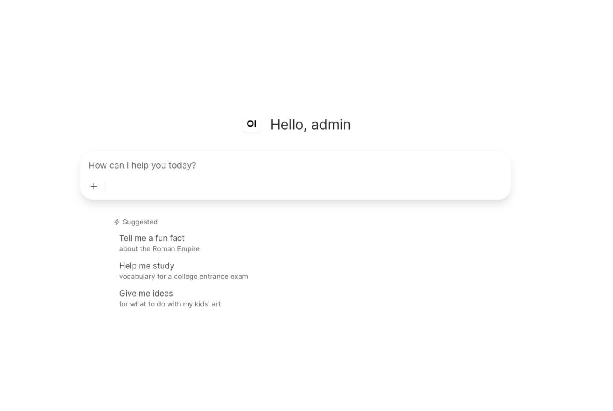
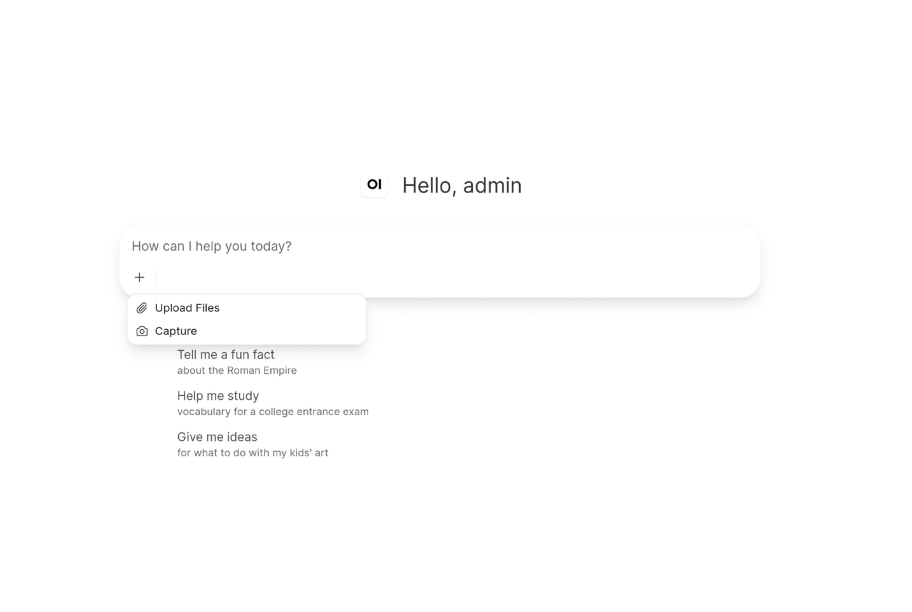

# open-webui-chat-simplified

Updated for v0.11.4

How to build a custom docker image of Open WebUI, modifying the layout, such as removing the sidebar and removing buttons from the chat page.

A guide for building a new docker image with Open WebUI modified according to projects' needs. This example produces the docker image that is publicly available at `ghcr.io/frautn/open-webui-chat-simplified:v0.11.0`.

The user only sees a stripped chat interface. No sidebar, no top bar, and stripped down tools (no select models, no dictate, etc).





Be careful though, even if not shown in the page, are accessible through a direct link. Further tuning is needed to address this, if relevant.

1. **Clone the official repo:**

```bash
git clone https://github.com/open-webui/open-webui.git open-webui-custom
cd open-webui-custom

```

2. **Remove the sidebar in code:**  

Open `src/routes/(app)/+layout.svelte` and remove/comment out `<Sidebar/>`.


3. **Remove the Navbar:**  

In the chat page, there is a top navbar with two buttons (temporary chat and controls).

Open `src/lib/components/chat/Chat.svelte` and remove/comment out the section `<Navbar  ...  />`.

4. **Remove Integrations, the Model Selector, Dictate (Microphone) Button and the Voice Mode Button**  

Open `src/lib/components/chat/MessageInput.svelte` and remove/comment out the `<div>` section that holds these elements. Look for something similar to this:  

```html
<div class="flex flex-1 items-center min-w-0 overflow-x-auto scrollbar-none">
  {#if showWebSearchButton || showImageGenerationButton || showCodeInterpreterButton || showToolsButton || showSkillsButton || (toggleFilters && toggleFilters.length > 0)}
    <IntegrationsMenu
      selectedModels={selectedModelIds}
...
</div>
```

5. **Remove unwanted entries in the More menu**

We are leaving only Upload Files and Capture in the dropdown menu displayed by the plus button (More).

Open `src/lib/components/chat/MessageInput/InputMenu.svelte` and remove the entries for Attach Webpage, Attach Files, Attach Notes, Attach Knowledge, Reference Chats in the dropdown menu. They look like this:

```html
<Tooltip
  content={fileUploadCapableModels.length !== selectedModels.length
    ? $i18n.t('Model(s) do not support file upload')
    : !fileUploadEnabled
      ? $i18n.t('You do not have permission to upload files.')
      : ''}
  className="w-full"
>
  <button
    class="flex gap-2 w-full items-center h-[1.6875rem] px-2 text-[13px] font-normal cursor-pointer hover:bg-gray-50/40 dark:hover:bg-gray-800/40 rounded-xl {!fileUploadEnabled
      ? 'opacity-50'
      : ''}"
    on:click={() => {
      tab = 'chats';
    }}
  >
    <ClockRotateRight />

    <div class="flex items-center w-full justify-between">
      <div class=" line-clamp-1">
        {$i18n.t('Reference Chats')}
      </div>

      <div class="text-gray-500">
        <ChevronRight />
      </div>
    </div>
  </button>
</Tooltip>
```

6. **Remove Model Selector:**

The user can't change the model.

Open `src/lib/components/chat/ModelSelector.svelte` and remove

```html
<div class="flex min-w-0 max-w-full flex-col items-start">
	<div class="flex min-w-0 max-w-full">
		<div class="min-w-0 max-w-full overflow-hidden">
			<div class="min-w-0 max-w-full">
				<Selector
					bind:this={selector}
					id="model"
					placeholder={$i18n.t('Select a model')}
					items={$models.map((model) => ({
						value: model.id,
						label: resolveLocalizedModelName(model, $i18n.language),
						model: model
					}))}
					{pinModelHandler}
					{className}
					{triggerClassName}
					{placement}
					{align}
					{showSetDefault}
					onSetDefault={saveDefaultModel}
					multipleEnabled={$user?.role === 'admin' ||
						($user?.permissions?.chat?.multiple_models ?? true)}
					{disabled}
					bind:compareEnabled={compareModels}
					bind:values={selectedModels}
				/>
			</div>
		</div>
	</div>
</div>
```

7. **Remove Suggestions:**

This could be removed in settings, but this also works.

Open `src/lib/components/chat/Placeholder.svelte` and remove:

```html
{:else}
		<div class="mx-auto max-w-2xl mt-2" in:fade={{ duration: 200, delay: 200 }}>
			<div class="mx-5">
				<Suggestions suggestionPrompts={selectedSuggestionPrompts} inputValue={prompt} {onSelect} />
			</div>
		</div>
```

Open `src/lib/components/chat/ChatPlaceholder.svelte` and remove:

```html
<div class=" w-full" in:fade={{ duration: 200, delay: 300 }}>
  <Suggestions
    className="grid grid-cols-2"
    suggestionPrompts={selectedSuggestionPrompts}
    {onSelect}
  />
</div>
```


8. **Build your modified Docker image:**

IF NOT IN ARM:
```bash
docker build -t open-webui-chat-simplified:v0.11.4 .
```

Tag matches the Open WebUI version used for this custom image.

Build for ARM (handy for cloud instances):

```bash
# Ensure buildx builder is ready
docker buildx create --use

docker buildx build  --platform linux/arm64 \
  --build-arg NODE_OPTIONS="--max-old-space-size=16384" \
  -t open-webui-chat-simplified:v0.11.4-arm \
  --load .
```

---

9. **Push the docker image:**

To push your custom Docker image to **GitHub Container Registry (GHCR)**, follow these steps:


#### Step 1: Generate a Personal Access Token (PAT) on GitHub

1. Go to GitHub: **Settings** $\rightarrow$ **Developer Settings** $\rightarrow$ **Personal access tokens** $\rightarrow$ **Tokens (classic)** (or Fine-grained tokens).
2. Click **Generate new token**.
3. Set the name (e.g., `GHCR Token`) and check the following scopes:
* `write:packages` (Upload packages to GitHub Container Registry)
* `read:packages` (Download packages)
* `delete:packages` *(optional)*

4. Click **Generate token** and copy the generated token string (`ghp_...`).

#### Step 2: Log In to GHCR via Docker (On Your Local Machine)

In your terminal, log in to `ghcr.io` using your GitHub username and the PAT you just generated:

```bash
echo "YOUR_GITHUB_PAT" | docker login ghcr.io -u YOUR_GITHUB_USERNAME --password-stdin

```

> You should see `Login Succeeded`.


#### Step 3: Tag Your Docker Image

Tag your locally built image using the `ghcr.io` naming structure:

`ghcr.io/YOUR_GITHUB_USERNAME/IMAGE_NAME:TAG`

```bash
docker tag open-webui-chat-simplified:v0.11.4-arm ghcr.io/frautn/open-webui-chat-simplified:v0.11.4-arm
```

*(Replace `frautn` with your actual GitHub username, in lowercase).*


#### Step 4: Push the Image to GHCR

```bash
docker push ghcr.io/frautn/open-webui-chat-simplified:v0.11.4-arm
```

#### Step 5: Make Package Public

By default, newly pushed packages on GHCR are set to **Private**. To pull it on your remote server:

1. On GitHub, go to your profile $\rightarrow$ **Packages** tab.
2. Select `open-webui-custom`.
3. Go to **Package Settings** (bottom right).
4. Under **Change package visibility**, set it to **Public**.

Now you can pull it on your server without logging in:

```bash
docker pull ghcr.io/frautn/open-webui-chat-simplified:v0.11.4-arm

```
